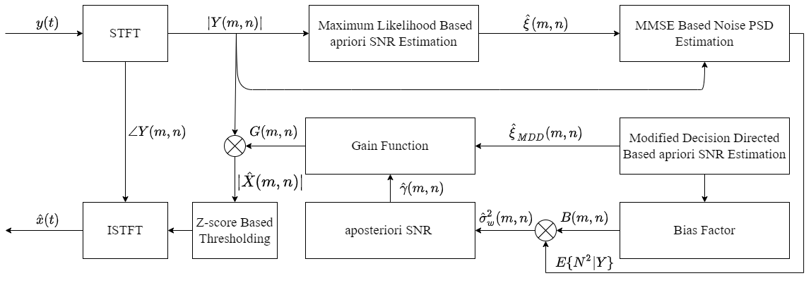

# Streamy

## Overview

**Streamy** is an AI Powered Proxy Streaming Server. 
This System Support Multiples Ways:
* Content Aware Video Encoding (Video Conferencing Oriented)
* Speech Enhancement
* Speech To Text Translation. 

**NOTE:** This System Is Still Under Development and there are not any release yet.

## Installation
**Installation guide is coming soon..**

## Content Aware Video Encoding (CAE)
The main idea is to remove unnecessary high frequencies from the less important area of 
the frames. we got the main idea from [1].

### Selfie Segmentation Based CAE
In this system we've used [MediaPipe Selfie Segmentation ](https://google.github.io/mediapipe/solutions/selfie_segmentation.html) as **ROI Detection Algorithm**.

### Motion Based CAE
In this system MOG2 Background subtraction [2] as a **ROI Detection Algorithm** However, 
this method is considered less effective and efficient in 
normal condition because it is required a very stable camera
,so in the future, we aim to use a **Free Moving Camera Background Subtraction Algorithm**.

## Speech Enhancement
For **Speech Enhancement** of stream we've implement three different methods

### Thresholding Based Audio Denoiser
In this system we apply a fuzzy thresholding on signal components in time-frequency domain 

### Noise PSD Estimation Based Audio Denoiser
In this system used modified implementation of the algorithm proposed in [3] with **Wiener Filter**

### DEMUCS Based Speech Enhancement
In this system we've used the model proposed in [4]. and adapt the hole code of this
system from his [official implementation](https://github.com/facebookresearch/denoiser)

## Speech To Text Translation
**Still under development**

## References
[1] _Sun, L., Décombas, M. and Lang, J._, 2016, June. Video Object Segmentation for Content-Aware Video Compression. In 2016 13th Conference on Computer and Robot Vision (CRV) (pp. 116-123). IEEE. 
[2] _Zivkovic, Z._, 2004, August. Improved adaptive Gaussian mixture model for background subtraction. In Proceedings of the 17th International Conference on Pattern Recognition, 2004. ICPR 2004. (Vol. 2, pp. 28-31). IEEE. 
[3] _Hendriks, R.C., Heusdens, R. and Jensen, J._, 2010, March. MMSE based noise PSD tracking with low complexity. In 2010 IEEE International Conference on Acoustics, Speech and Signal Processing (pp. 4266-4269). IEEE. 
[4] _Defossez, A., Synnaeve, G. and Adi, Y._, 2020. Real time speech enhancement in the waveform domain. arXiv preprint arXiv:2006.12847.
